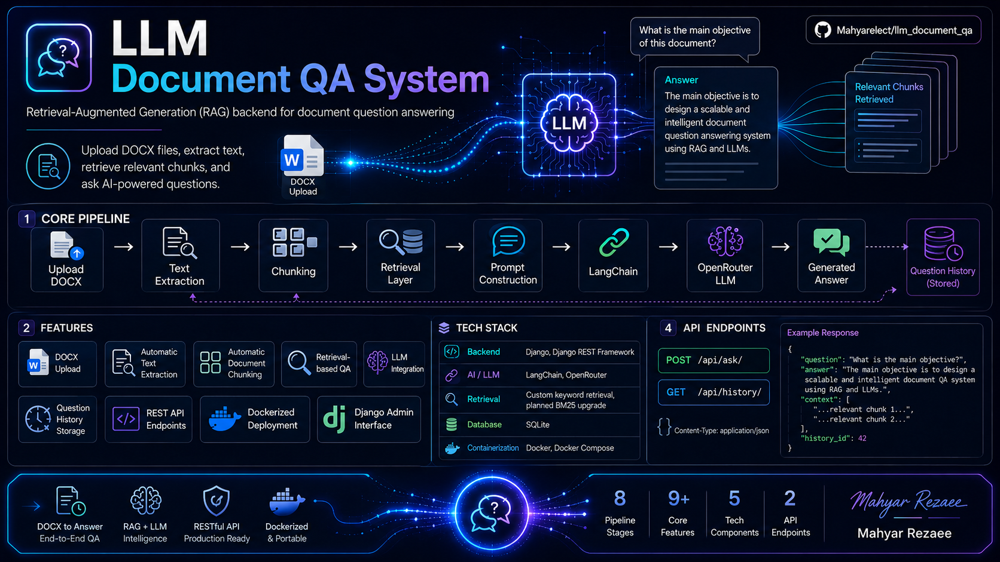

# 📄 LLM Document QA System



A Retrieval-Augmented Generation backend system for asking AI-powered questions about uploaded DOCX documents.

This project extracts text from documents, splits the content into searchable chunks, retrieves the most relevant parts, and sends them to an LLM through OpenRouter to generate grounded answers.

---

## 📌 Project Overview

**LLM Document QA System** is a Django REST API for document-based question answering.

Users can upload DOCX files, and the system prepares those documents for AI search and question answering. When a question is submitted, the backend finds the most relevant document chunks and gives them to the LLM as context.

This makes the answer more focused, more document-aware, and more efficient than sending the full document every time.

### Useful For

* Internal document Q&A
* Knowledge-base assistants
* Report analysis
* Resume and profile analysis
* Business document review
* Academic document search
* Backend service for a future chatbot or web app

---

## 🧰 Tech Stack

| Part               | Technology                  |
| ------------------ | --------------------------- |
| Backend            | Django                      |
| API Layer          | Django REST Framework       |
| AI / LLM Layer     | LangChain, OpenRouter       |
| Document Parsing   | python-docx                 |
| Retrieval          | Chroma vector search, BM25, hybrid RRF |
| Database           | SQLite + Chroma             |
| Admin Panel        | Django Admin                |
| Environment Config | python-dotenv               |
| Containerization   | Docker, Docker Compose      |
| Language           | Python                      |

---

## 🏗️ Architecture

The project follows a practical RAG pipeline.

```text
DOCX Document
     ↓
Django Admin Upload
     ↓
Text Extraction
     ↓
Document Chunking
     ↓
SQLite + persistent Chroma vector store
     ↓
Question API
     ↓
Retrieval Layer
     ↓
Prompt Construction
     ↓
LangChain
     ↓
OpenRouter LLM
     ↓
Generated Answer
     ↓
Question History
```

### 1. Document Upload Layer

Documents are uploaded through Django Admin.

When a DOCX file is saved, the system automatically:

* Reads the uploaded file
* Extracts text from the document
* Stores the full extracted text
* Splits the document into smaller chunks
* Saves those chunks in the database

This prepares the document for fast retrieval later.

---

### 2. Retrieval Layer

When a question is submitted, the backend searches the saved chunks and selects the most relevant ones.

The project supports four search methods:

| Method   | Description                                     |
| -------- | ----------------------------------------------- |
| `simple` | Basic keyword-based matching                    |
| `bm25`   | Ranked information retrieval using BM25 scoring |
| `vector` | Semantic cosine search over Chroma embeddings   |
| `hybrid` | BM25 + vector search combined with reciprocal rank fusion |

BM25 helps improve search quality by ranking chunks based on relevance instead of only checking direct keyword overlap.

---

### 3. Prompt Construction Layer

After the best chunks are selected, the backend builds a prompt for the LLM.

The prompt includes:

* The user question
* The retrieved document context
* Instructions to answer based only on the provided context

This helps keep answers grounded in the uploaded documents.

---

### 4. LLM Layer

The system uses LangChain to connect the backend to OpenRouter.

OpenRouter allows the project to use different LLM models through environment variables without changing the main application code.

---

### 5. History Layer

Every question and answer is saved in the database.

The saved history includes:

* User question
* Generated answer
* Retrieved context
* Creation timestamp

This makes the system easier to test, debug, and review.

---

## 🔄 Data Flow

```text
User Question
   ↓
Django REST API
   ↓
Request Validation
   ↓
Search Stored Chunks
   ↓
Select Top Relevant Context
   ↓
Build LLM Prompt
   ↓
Send Request to OpenRouter
   ↓
Receive Answer
   ↓
Save Question History
   ↓
Return JSON Response
```

### Step-by-Step Flow

1. A DOCX document is uploaded from Django Admin.
2. The system extracts text from the document.
3. The text is split into smaller chunks.
4. Chunks are saved in SQLite.
5. A user sends a question to the API.
6. The backend validates the request.
7. The retrieval layer finds the most relevant chunks.
8. The selected chunks are used as context for the LLM.
9. LangChain sends the prompt to OpenRouter.
10. The LLM generates an answer.
11. The answer and context are saved in history.
12. The API returns the final answer as JSON.

---

## ✨ Features

### Core Features

* DOCX document upload
* Automatic text extraction
* Automatic document chunking
* Retrieval-based question answering
* Simple keyword search
* BM25 search option
* LangChain integration
* OpenRouter LLM integration
* Question history storage
* Django Admin interface
* REST API endpoints
* Dockerized deployment

---

### Retrieval Features

* Search across all stored document chunks
* Rank chunks by relevance
* Select top matching chunks
* Choose search method per request
* Store retrieved context with each answer
* Return a fallback message when no useful context is found

---

### Admin Features

Django Admin can be used to manage and inspect:

* Uploaded documents
* Extracted document text
* Generated chunks
* Question history
* Retrieved context
* LLM-generated answers

This is helpful for testing, reviewing results, and improving the retrieval flow.

---

## 📁 Project Structure

```text
llm_document_qa/
│
├── config/                    # Django project configuration
│   ├── settings.py
│   ├── urls.py
│   ├── asgi.py
│   └── wsgi.py
│
├── documents/                 # Main document QA app
│   ├── admin.py               # Django Admin setup
│   ├── models.py              # Document, chunk, and history models
│   ├── serializers.py         # API serializers
│   ├── services.py            # Retrieval and LLM logic
│   ├── urls.py                # App routes
│   ├── views.py               # API views
│   └── migrations/
│
├── assets/                    # README and project assets
├── screenshots/               # Existing visual assets
├── API_DOCUMENTATION.md       # Detailed API documentation
├── Dockerfile
├── docker-compose.yml
├── manage.py
├── requirements.txt
└── README.md
```

---

## 🚀 Setup Instructions

## 1. Clone the Repository

```bash
git clone https://github.com/thisiscodecode/llm_document_qa.git
cd llm_document_qa
```

---

## 2. Create a Virtual Environment

```bash
python -m venv venv
```

Activate it:

### Windows

```bash
venv\Scripts\activate
```

### Linux / macOS

```bash
source venv/bin/activate
```

---

## 3. Install Dependencies

```bash
pip install -r requirements.txt
```

---

## 4. Create `.env` File

Create a `.env` file in the project root:

```env
OPENROUTER_API_KEY=your_openrouter_api_key
OPENROUTER_MODEL=your_selected_model
OPENROUTER_EMBEDDING_MODEL=openai/text-embedding-3-small
CHROMA_PATH=chroma_db
```

Example:

```env
OPENROUTER_MODEL=openrouter/free
```

---

## 5. Run Migrations

```bash
python manage.py makemigrations
python manage.py migrate
```

If the project already contains processed chunks, build Chroma after migrating:

```bash
python manage.py rebuild_chroma_index
```

---

## 6. Create Superuser

```bash
python manage.py createsuperuser
```

---

## 7. Run Development Server

```bash
python manage.py runserver
```

Server URL:

```text
http://127.0.0.1:8000/
```

Django Admin:

```text
http://127.0.0.1:8000/admin/
```

---

## 📤 Uploading Documents

Documents are uploaded from Django Admin.

1. Open Django Admin.
2. Log in with the superuser account.
3. Go to the Documents section.
4. Add a new document.
5. Upload a DOCX file.
6. Save the document.

After saving, the system extracts the text and creates searchable chunks automatically.

---

## 🔌 API Endpoints

## Ask Question

```http
POST /api/ask/
```

### Request

```json
{
  "question": "What is this document about?"
}
```

### Request with BM25 Search

```json
{
  "question": "What is this document about?",
  "search_method": "bm25"
}
```

### Response

```json
{
  "question": "What is this document about?",
  "search_method": "bm25",
  "answer": "The document explains...",
  "context": "Retrieved document chunks...",
  "history_id": 1
}
```

---

## Question History

```http
GET /api/history/
```

### Response

```json
[
  {
    "id": 1,
    "question": "What is this document about?",
    "answer": "The document explains...",
    "retrieved_context": "Relevant document chunks...",
    "created_at": "2026-05-19T04:43:55.521861Z"
  }
]
```

---

## 🔍 Search Methods

## Simple Search

Simple search compares words from the question with words inside each document chunk.

It is useful for basic matching and small document collections.

```json
{
  "question": "What skills are mentioned?",
  "search_method": "simple"
}
```

---

## BM25 Search

BM25 is a stronger ranking method for information retrieval.

It scores chunks based on how relevant they are to the question and returns the best matches.

```json
{
  "question": "What skills are mentioned?",
  "search_method": "bm25"
}
```

---

## Vector and Hybrid Search

Vector search uses Chroma cosine similarity. Hybrid search is the recommended
default: it fuses Chroma semantic results with BM25 lexical results before
reranking and building a token-bounded context.

```json
{
  "question": "What skills are mentioned?",
  "search_method": "hybrid"
}
```

---

## 🐳 Docker Setup

## Build Docker Image

```bash
docker compose build --no-cache
```

---

## Run Container

```bash
docker compose up
```

---

## Run Migrations Inside Docker

```bash
docker compose exec web python manage.py migrate
```

---

## Create Superuser Inside Docker

```bash
docker compose exec web python manage.py createsuperuser
```

The API will be available at:

```text
http://127.0.0.1:8000/
```

---

## ⚙️ Environment Variables

| Variable             | Required | Description                           |
| -------------------- | -------- | ------------------------------------- |
| `OPENROUTER_API_KEY` | Yes      | API key used to connect to OpenRouter |
| `OPENROUTER_MODEL`   | Yes      | Selected LLM model name               |
| `OPENROUTER_EMBEDDING_MODEL` | No | Embedding model (defaults to `openai/text-embedding-3-small`) |
| `CHROMA_PATH` | No | Local persistent Chroma directory (defaults to `chroma_db`) |
| `CHROMA_HOST` | No | Chroma server hostname for production client/server mode |
| `CHROMA_PORT` | No | Chroma server port (defaults to `8000`) |

Keep these values private and never commit them to Git.

---

## 🧪 Example Workflow

1. Start the Django server.
2. Open Django Admin.
3. Upload a DOCX document.
4. Let the system extract and chunk the text.
5. Send a question to `/api/ask/`.
6. Use the default `hybrid` search (or select `simple`, `bm25`, or `vector`).
7. Review the generated answer.
8. Check `/api/history/` to see saved questions and answers.

---

## 🛡️ Security Notes

Before production use:

* Move `SECRET_KEY` to environment variables
* Set `DEBUG=False`
* Configure `ALLOWED_HOSTS`
* Protect Django Admin access
* Keep `.env` private
* Never commit API keys
* Do not commit `db.sqlite3`
* Use HTTPS
* Add authentication before exposing the API publicly
* Add rate limiting for LLM requests

---

## ⚠️ Current Limitations

* SQLite database by default
* No public API authentication by default
* No streaming responses

---

## 🧭 Future Improvements

Possible improvements for future versions:

* JWT authentication
* PostgreSQL support
* Streaming LLM responses
* Chat-style conversation interface
* File upload endpoint
* Background processing for large documents

---

## 📄 License

This project is licensed under the **MIT License**.

---

## 👥 Author

Built by the **codecode** team.
